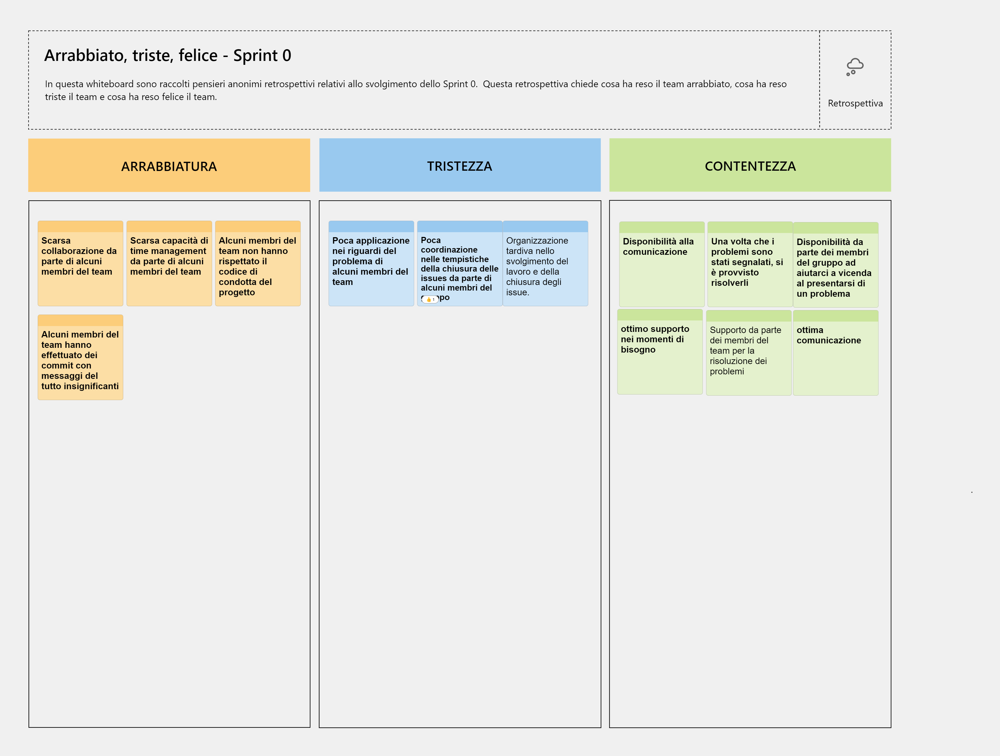

# Report
**Indice**
 + [Introduzione](#1-introduzione)
 + [Modello di dominio](#2-modello-di-dominio)
 + [Requisiti specifici](#3-requisiti-specifici)
	 + [Requisiti funzionali](#31-requisiti-funzionali)
	 + [Requisiti non funzionali](#32-requisiti-non-funzionali)
+ [Riepilogo dei test](#6-riepilogo-dei-test)
+ [Manuale utente](#7-manuale-utente)
+ [Analisi retrospettiva](#9-analisi-retrospettiva)
	 + [Sprint 0](#91-sprint-0)

# 1. Introduzione
Benvenuti a "Battaglia Navale", classico gioco da tavolo in cui sfiderai un avversario virtuale controllato dal computer. 
Preparati a mettere alla prova le tue abilità strategiche in un emozionante scontro navale.
"Battaglia Navale" offre un'esperienza coinvolgente e realistica, consentendoti di giocare contro un avversario che userà strategie avanzate per cercare di distruggere le tue navi. 
Potrai scegliere diversi livelli di difficoltà, da facile a difficile, per adattare la sfida alle tue capacità.
All'inizio del gioco, avrai la possibilità di posizionare le tue navi sulla tua griglia. 
Dovrai scegliere attentamente le posizioni delle tue navi per nasconderle al meglio e rendere difficile individuarle. 
Assicurati di utilizzare strategie di posizionamento tattiche per mettere in difficoltà il tuo avversario.
Una volta che le navi sono posizionate, inizia la fase di attacco. 
La CPU dispone le navi che tu giocatore dovrai affondare, sparando missili sulla griglia. 
	
	
# 2. Modello di dominio
Rappresentazione del modello di dominio del progetto:

# 3. Requisiti specifici

## 3.1 Requisiti funzionali

### RF1:Iniziare una nuova partita

#### Criteri di accettazione:

Al comando **/gioca**

se nessuna partita è in corso l'applicazione imposta causalmente le navi, in orizzontale o in verticale, mostra la griglia vuota e si predispone a ricevere il primo tentativo o altri comandi.

### RF2:Chiudere il gioco

#### Criteri di accettazione:

Al comando **/esci**

l'applicazione chiede conferma

- se la conferma è positiva, l'applicazione si chiude restituendo il controllo al sistema operativo

- se la conferma è negativa, l'applicazione si predispone a ricevere nuovi tentativi o comandi

### RF3:Help e elenco comandi

#### Criteri di accettazione

Al comando **/help** o invocando l'app con flag --help o -h

il risultato è una descrizione concisa, che normalmente appare all'avvio del programma, seguita dalla lista di comandi disponibili, uno per riga, come da esempio successivo:

- gioca

- esci

- ...

### RF4:Impostare il livello di gioco per variare il numero massimo di tentativi sbagliati

#### Criteri di accettazione

- Al comando **/facile**

l’applicazione risponde con OK e imposta a 50 il numero massimo di tentativi falliti

- Al comando **/medio**

l’applicazione risponde con OK e imposta a 30 il numero massimo di tentativi falliti

- Al comando **/difficile**

l’applicazione risponde con OK e imposta a 10 il numero massimo di tentativi falliti

### RF5:Mostrare il livello di gioco e il numero di massimo di tentativi falliti

#### Criteri di accettazione

Al comando **/mostralivello**

l’applicazione risponde visualizzando il livello di gioco e il numero di massimo di tentativi falliti

### RF6:Mostrare i tipi di nave e il numero

#### Criteri di accettazione

Al comando **/mostranavi**

l’applicazione risponde visualizzando, per ogni tipo di nave, la dimensione in quadrati e il numero di esemplari da affondare:

- Cacciatorpediniere 	⊠⊠ 		esemplari: 4

- Incrociatore 		⊠⊠⊠ 		esemplari: 3

- Corazzata 		⊠⊠⊠⊠ 	esemplari: 2

- Portaerei  		⊠⊠⊠⊠⊠ 	esemplari: 1

### RF7:Svelare la griglia con le navi posizionate

Al comando **/svelagriglia**

l’applicazione risponde visualizzando, una griglia 10x10, con le righe numerate da 1 a 10 e le colonne numerate da A a J, e tutte le navi posizionate

## 3.2 Requisiti non funzionali

### RNF1: il container docker dell’app deve essere eseguito da terminali che supportano Unicode con encoding UTF-8 o UTF-16.
Elenco di terminali supportati

**Linux**:

- terminal

**Windows**:

- Powershell
- Git Bash (in questo caso il comando Docker ha come prefisso winpty; es: winpty docker -it ....)

# 6. Riepilogo dei test

Casi di test automatici con junit.

Abbiamo creato una classe di test per ogni classe java del progetto, fatta eccezione delle classi UI boundery perché i casi di test autiomatici non possono prevedere ogni singolo inserimento dell'utente.
Tutte le classi di test sono contenute in una cartella separata dal resto del codice, cartella src/Test/java . La stuttura di questa cartella, rispecchia quella delle classi java.

Per il package 'Ship' sono stati generati casi di test automatici in JUnit per le classi:
-TestCacciatorpediniere, TestCorazzata, TestIncrociatore, TestPortaerei,
i test riguardando la corretta costruzione e il corretto posizionamento delle navi sulla griglia di gioco;

-TestOrientation,
i test riguardano il corretto orientamento delle navi. Verificano che il metodo statico values() dell'enumerazione Orientation restituisca correttamente un array contenente tutti i valori dell'enumerazione. Verificano che il metodo toString() dell'enumerazione Orientation restituisca correttamente la rappresentazione testuale di ciascun valore dell'enumerazione. Infine verificano che il metodo statico valueOf() dell'enumerazione Orientation restituisca correttamente l'istanza dell'enumerazione corrispondente a una determinata stringa;

-TestShip,                                                                                                                                                                  
i test riguardano le dimensioni, le coordinate e lo stato della nave (se essa è stata affondata oppure no). Metodo shipInitialization_shouldSetPropertiesCorrectly():
 Questo metodo di test verifica che una nave sia inizializzata correttamente e che le sue proprietà siano impostate correttamente.
Crea una nave con una lunghezza di 4, orientamento orizzontale, posizione di inizio ('a', 3) e una griglia booleana 10x10.
Verifica che la lunghezza, i colpi ricevuti, lo stato di affondamento, l'orientamento e la posizione di inizio siano impostati correttamente.
Metodo shipHit_shouldIncrementHitsAndSinkWhenFullyHit():
Questo metodo di test verifica che i colpi su una nave vengano incrementati correttamente e che la nave si affondi completamente quando viene colpita in tutti i suoi punti.
Crea una nave con una lunghezza di 3, orientamento verticale, posizione di inizio ('c', 5) e una griglia booleana 10x10.
Chiama il metodo hit() sulla nave tre volte e verifica che i colpi ricevuti siano incrementati correttamente dopo ogni colpo.
Verifica anche che la nave non sia affondata dopo il primo e il secondo colpo, ma sia affondata dopo il terzo colpo. Metodo shipHit_shouldNotSinkWhenNotFullyHit():
Questo metodo di test verifica che la nave non si affondi quando viene colpita solo parzialmente.
Crea una nave con una lunghezza di 4, orientamento orizzontale, posizione di inizio ('e', 2) e una griglia booleana 10x10.
Chiama il metodo hit() sulla nave tre volte e verifica che i colpi ricevuti siano incrementati correttamente dopo ogni colpo.
Verifica che la nave non sia affondata dopo il primo, il secondo e il terzo colpo.
Classe interna TestShip1:
Questa classe interna estende la classe Ship ed è utilizzata per scopi di test.
Viene utilizzata per creare istanze di Ship nei test.
Per il package 'util' sono stati generati casi di test automatici in JUnit per la classe:
-TestPair
i test verificano che sia possibile creare correttamente una coppia valida utilizzando il costruttore della classe Pair.
Controllano se il primo e il secondo elemento della coppia corrispondono a quelli forniti, se viene lanciata correttamente l'eccezione 'IllegalArgumentException'. Verificano che il metodo toArray() della classe Pair restituisca correttamente un array di interi rappresentante la coppia. Creano una coppia e controllano se l'array restituito corrisponde a quello atteso.  Verificano che il metodo equals() della classe Pair funzioni correttamente.  Verificano che il metodo hashCode() della classe Pair generi correttamente il codice hash per le coppie.
Infine verificano che il metodo toString() della classe Pair restituisca correttamente la rappresentazione della coppia come stringa nel formato "A-1".

Per il package 'app' sono stati generati casi di test automatici in JUnit per le classi:
-TestApp,
i metodi nei test verificano:
comportamento del metodo handleDifficolta dell'applicazione in risposta all'input utente; il comportamento del metodo handleTentativi dell'applicazione che gestisce l'impostazione del numero di tentativi; il comportamento del metodo handleGioca dell'applicazione che avvia una partita;  il comportamento del metodo handleSvelaGriglia dell'applicazione che mostra la griglia delle navi; il comportamento del metodo handleTempo dell'applicazione che gestisce l'impostazione del tempo; il comportamento del metodo handleMossa dell'applicazione che gestisce l'input di una mossa; il comportamento del metodo handleAbbandona dell'applicazione che gestisce l'abbandono della partita.

-TestBattleshipGame,

-TestDifficulty,
i test riguardano la corretta impostazione del livello di difficoltà;
-TestGridSize,
i test riguardano la corretta impostazione della dimensione della griglia di gioco;

# 7. Manuale utente
Schermata Principale:
Quando verrà avviata l'app, si verrà accolti dalla schermata principale. Da qui, si avrà accesso alle seguenti opzioni per selezionare il livello di difficoltà della partita:

- facile: digitare '/facile';
- medio: digitare '/medio';
- difficile: digitare '/difficile'.

Se si desidera visualizzare il livello di difficoltà selezionato, digitare nella linea di comando:
- '/mostralivello'.

Se si desidera visualizzare le navi (pedine di gioco) a disposizione, digitare nella linea di comando:
- '/mostranavi'.

Per avviare una partita, una volta impostato il livello di difficoltà, digitare '/gioca' e attendere.
Verranno generate casualmente la posizione e l'orientamento delle navi e verrà  verificato che non ci siano sovrapposizioni.
Se non vengono rilevati errori, verrà visualizzato il messaggio 'Navi posizionate e partita iniziata.', in caso contrario sarà necessario riavviare l'esecuzione del gioco.
Adesso sarà possibile visualizzare la griglia di gioco con la disposizione delle navi.

# 9. Analisi retrospettiva

## 9.1 Sprint 0

In seguito viene riportata la board retrospettiva di modello Mad, Sad, Glad relativa allo sprint 0. Questa serve a raccogliere le opinioni dei membri del team in modo anonimo ed evidenziare criticità e punti di forza, in modo tale da poter lavorare per migliorare i punti deboli ed essere a conoscenza e utilizzare al meglio i punti di forza del team.

